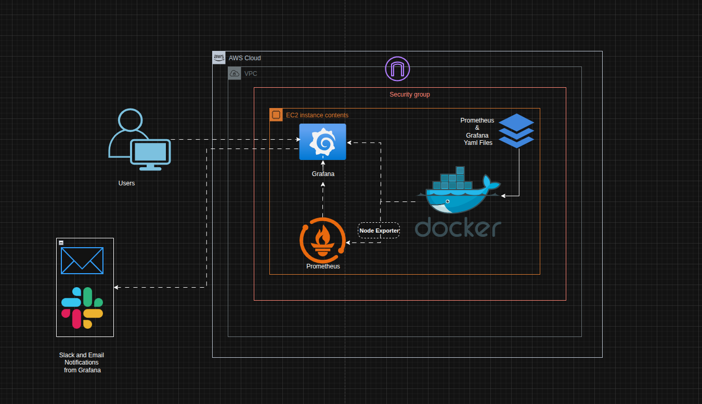

# Grafana Monitoring Stack

A complete monitoring solution using Prometheus, Grafana, and Node Exporter to monitor system metrics and create custom dashboards on ec2.

## Overview

This project sets up a monitoring stack with:
- **Prometheus**: Time-series database for metrics collection
- **Grafana**: Visualization and dashboarding platform
- **Node Exporter**: System metrics collector

## Prerequisites

- Docker 28.2.2


## Architecture




## Getting started

1. Clone the repository:
   ```bash
   git clone https://github.com/Ghaby-X/Grafana_monitoring.git
   cd Grafana_monitoring
   ```

2. Start the monitoring stack:
   ```bash
   docker-compose up -d
   ```

NB: before starting docker compose configure smth
   ```
   - GF_SMTP_ENABLED=true
      - GF_SMTP_HOST=smtp.gmail.com:587
      - GF_SMTP_USER=<your_email>
      - GF_SMTP_PASSWORD=<app_password>
      - GF_SMTP_FROM_ADDRESS=<your_email>
      - GF_SMTP_FROM_NAME=Grafana Alerts
      - GF_SMTP_SKIP_VERIFY=true
   ```

Nb: When using an ec2 instance, ensure port 3000, 9090 and 9100 is allowed


3. Access the services:
   - **Grafana**: http://localhost:3000
   - **Prometheus**: http://localhost:9090
   - **Node Exporter**: http://localhost:9100

## Configuration

### Prometheus Configuration
The `prometheus.yml` file configures:
- Global scrape interval: 10 seconds
- Node Exporter as a scrape target on port 9100

### Docker Compose Services
- **Prometheus**: Runs on port 9090 with persistent data storage
- **Node Exporter**: Collects system metrics from the host
- **Grafana**: Web interface on port 3000 with persistent dashboards

## Usage

### Setting up Grafana
1. Login to Grafana at http://localhost:3000
2. Add Prometheus as a data source: http://prometheus:9090
3. Import dashboards or create custom ones
4. Monitor system metrics like CPU, memory, disk usage, and uptime

### Available Metrics
Node Exporter provides metrics including:
- System uptime
- CPU usage
- Memory utilization
- Disk space
- Network statistics

## Screenshots
The `screenshots/` directory contains step-by-step visual result showing:
- Docker Compose startup
- Prometheus dashboard
- Grafana configuration
- Custom dashboard creation
- Imported dashboard examples

## Stopping the Stack

```bash
docker-compose down
```


# QUESTIONS AND ANSWERS
## QUESTION 1: Container Orchestration Analysis

Examine the Docker Compose configuration used in this lab. Explain why the Node Exporter 
container requires mounting host directories (/proc, /sys, /) and what would happen if these 
mounts were removed or configured incorrectly. How does this design decision reflect the 
principle of containerized monitoring? 

### Answer

The Node Exporter container mounts "/proc", "/sys", and "/" from the host to access information. These virtual filesystems provide runtime metrics like CPU, memory, and disk statistics. Without them, Node Exporter would only see the container’s isolated environment, not the actual host's state.

If these mounts are misconfigured or removed, Node Exporter would either fail to start or collect incorrect metrics. This setup enables Node Exporter to bridge into the host to collect low-level data, maintaining visibility without full host installation.


## QUESTION 2: Network Security Implications

The lab creates a custom Docker network named "prometheus-grafana". Analyze the security 
implications of this setup versus using the default Docker network. What potential 
vulnerabilities could arise from the current port exposure configuration (9090, 9100, 3000), and 
how would you modify the setup for a production environment?

### Answer

The Compose file defines a custom Docker bridge network called prometheus-grafana. This provides a level of isolation between containers and avoids exposing them to all Docker services, which is more secure than using the default bridge network.

However, ports 9090 (Prometheus), 9100 (Node Exporter), and 3000 (Grafana) are exposed to the host. In a production setup, this can lead to unauthorized access if those ports are exposed to the public internet. 

For production, access to these services should be restricted using a security group / firewalls.


## Question 3: Data Persistence Strategy 

Compare the volume mounting strategies used for Prometheus data versus Grafana data in the 
Docker Compose file. Explain why different approaches might be needed for different 
components and what would happen to your dashboards and historical metrics if you removed 
these volume configurations

### Answer
Prometheus and Grafana both use named volumes in this setup to store their respective data. Prometheus stores time-series metrics under /prometheus, while Grafana stores dashboards and configurations under /var/lib/grafana.

Persisting data is crucial. Without these volume mounts:

- Prometheus would lose all historical metrics on container restart.
- Grafana would lose dashboards, user configurations, and installed plugins.

Prometheus also makes use of binding volumes to map the prometheus.yml file on the host to the appropriate path on the container. This ensures that configurations on the prometheus.yml file from the host will be immediately visible and applicable on the container


## Section 2: Metrics and Query Understanding 
##  Question 4: PromQL Logic Breakdown

The tutorial uses this query for calculating uptime: 
node_time_seconds - node_boot_time_seconds 
Explain step-by-step what each metric represents, why subtraction gives us uptime, and what 
potential issues could arise with this calculation method. Propose an alternative approach and 
justify when you might use it instead.

## Answer
The query:

```
node_time_seconds - node_boot_time_seconds
```

calculates system uptime by subtracting the time at which the instance was booted from the current system time. node_time_seconds is the current timestamp, while node_boot_time_seconds marks when the system started.

This calculation assumes both timestamps are accurate and consistent. Problems may occur if time is adjusted, which can lead to inaccurate uptime results.

An alternative is to use time() - node_boot_time_seconds, which uses Prometheus’s inbuilt functions to compute the start time of the instance. 


## Question 5: Memory Metrics Deep Dive 
The lab uses node_memory_MemTotal_bytes - node_memory_MemAvailable_bytes to calculate 
memory usage. Research and explain why this approach is preferred over using 
node_memory_MemFree_bytes. What's the fundamental difference between "free" and 
"available" memory in Linux systems, and how does this impact monitoring accuracy? 

### Answer

The preferred memory usage calculation is:

```
node_memory_MemTotal_bytes - node_memory_MemAvailable_bytes
```

MemAvailable is a better indicator of usable memory than MemFree. MemFree can be close to zero even when the system has plenty of available memory. MemAvailable estimates how much memory can be safely allocated to new processes, accounting for cache and buffers.

Using MemFree may lead to false positives in monitoring, triggering alerts even when the system is not under memory pressure.

## Question 6: Filesystem Query Analysis 
Analyze this filesystem usage query: 
1 - (node_filesystem_avail_bytes{mountpoint="/"} / 
node_filesystem_size_bytes{mountpoint="/"}) 
Break down the mathematical logic, explain why the result needs to be subtracted from 1, and 
discuss what could go wrong if you monitoring multiple mount points with this approach. How 
would you modify this query to exclude temporary filesystems?

### Answer
Query:
```
1 - (node_filesystem_avail_bytes{mountpoint="/"} / node_filesystem_size_bytes{mountpoint="/"})

```

Breakdown:

- Divides available bytes by total size to get free space ratio.

- Subtracting from 1 gives "used space ratio".

Why subtract? Because it’s easier to alert on "90% full" than "10% available".

Problems with this query:

- It only targets the root filesystem.

- Doesn’t exclude temporary filesystems (tmpfs, overlay, etc.), which can throw off usage metrics.

```
1 - (
  node_filesystem_avail_bytes{fstype!~"tmpfs|devtmpfs|overlay"} /
  node_filesystem_size_bytes{fstype!~"tmpfs|devtmpfs|overlay"}
)

```


## Question 7: Visualization Type Justification 
The tutorial uses three different visualization types: Stat, Time Series, and Gauge. For each 
visualization created in the lab, justify why that specific type was chosen over alternatives. What 
criteria should guide visualization selection, and when might your choices be suboptimal?

### Answer

Visualization Type Justification
- Stat panel: Great for showing a single value like "current memory usage" or "uptime". It's simple and quick to read.

- Time Series: Best for trending metrics like CPU or memory usage over time.

- Gauge: Useful for showing metrics with thresholds — e.g., disk usage in red/yellow/green zones.

Choosing visuals depends on:

- Is the metric a point-in-time or a trend?

- Does the user need to take action based on this value?

- Is it bounded or unbounded (e.g., % usage vs. request count)?


## Question 8: Threshold Configuration Strategy 
Explain the reasoning behind the 80% threshold setting for disk usage in the gauge chart. 
Research industry standards and propose a more sophisticated alerting strategy that considers 
different types of systems (database servers, web servers, etc.). How would you implement 
multi-level thresholds that provide actionable insights?

### Answer
80% is a common rule-of-thumb, but not always the right choice.

Better approach:

- Database servers: Use lower thresholds (like 70%) data grows fast.

- Web servers: Maybe 85% is fine — logs rotate regularly.

- Cache nodes: Can go up to 90% because data is disposable.

I’d also consider:

- Multi-level thresholds:

      - Warning: 70%

      - Critical: 85%

      - Emergency: 95%

- Monitor growth rates, not just current values.

- Customize thresholds per mount type and role.


## Question 9: Dashboard Variable Implementation 
The tutorial introduces dashboard variables using the $job variable. Explain how this variable 
system works internally in Grafana, what happens when you have multiple values for a variable, 
and design a scenario where poorly implemented variables could break your dashboard. How 
would you test variable robustness?

### Answer

Grafana variables like $job let users filter data dynamically.

- It pulls label values from Prometheus (label_values(job)).

- When multiple values are selected, Grafana converts them to a regex: job=~"(job1|job2)".

Risks:

- If someone creates a job named .*, a query like up{job="$job"} could match everything.

- Queries can break or return unexpected results.

Safe practice:

```
up{job=~"^$job$"}
```

To test robustness:

- Try job names with special characters.

- Test with no values selected.

- See how queries behave with many jobs selected at once.

## Question 10 : Resource Planning and Scaling 
Based on your lab experience, calculate the approximate resource requirements (CPU, memory, 
storage) for monitoring 100 servers using this setup. Consider metric ingestion rates, retention 
periods, and dashboard query load. What bottlenecks would you expect to encounter first, and 
how would you address them?

### Answer

Rough estimate for 100 nodes:

- CPU: 4 cores (2 cores per 50 nodes is a good baseline).

- Memory: 16–32 GB RAM (for active series and queries).

- Storage: 400–600 GB for 30 days (at 15s intervals, ~1000 series per host).

- Network: ~10 Mbps continuous scraping traffic.

Likely bottlenecks:

- RAM usage from active series.
- Disk I/O from constant metric writes.
- Query load on Prometheus during dashboard refreshes.

Fixes:
- Use recording rules.
- Deploy on SSD-backed storage.
- Consider remote_write or Thanos for long-term storage.

## Question 11: High Availability Design 
The current lab setup is single-node. Design a high-availability architecture for this monitoring 
stack that can handle component failures. Explain your approach to data consistency, load 
balancing, and disaster recovery. What trade-offs would you make between complexity and 
reliability?

### Answer

A High Availability (HA) setup would include:

- Multiple Prometheus instances scraping the same targets (but only one handling alerts).
- A Grafana cluster behind a load balancer.
- RDS in HA mode for Grafana data.

Trade-offs:

- Higher complexity and cost.
- But gives you better resilience and fault tolerance.
- Some duplication of metrics is acceptable for reliability.

## Question 12:  Security Hardening Analysis 
Identify at least five security vulnerabilities in the lab setup and propose specific remediation 
strategies. Consider authentication, authorization, network security, and data protection. How 
would you implement secrets management and secure communication between components?

### Answer

In the lab setup, I identified five major security vulnerabilities and have proposed specific mitigation strategies for each:

1. Prometheus has no authentication

- Risk: Anyone who can access the port can view metrics or tamper with alert rules.

- Fix: Add basic auth via reverse proxy (e.g., NGINX) or use Prometheus behind an OAuth2 gateway like oauth2-proxy.

2. Grafana still uses default credentials (admin/admin)

- Risk: Anyone who knows the default can get full admin access.

- Fix: Enforce password reset on first login or bake in secrets management to inject randomized credentials.

3. No TLS between services

- Risk: Data and credentials are sent in plain text, vulnerable to interception.

- Fix: Use self-signed or proper TLS certificates between Prometheus, Node Exporter, and Grafana.

4. Services are all exposed on public ports

- Risk: Any attacker scanning your IP can access metrics endpoints.

- Fix: Limit exposure with firewall rules, only expose Grafana externally via HTTPS. Keep Prometheus and Node Exporter internal.

5. Containers running as root

- Risk: If exploited, attackers can break out of the container and access the host system.

- Fix: Configure Dockerfiles to run as non-root users, and set user: in docker-compose.

## Question 13: Debugging Methodology 
Describe a systematic approach to troubleshooting when Prometheus shows a target as 
"DOWN" in the targets page. Walk through the diagnostic steps you would take, including 
command-line tools, log analysis, and configuration verification. What are the most common 
causes and their solutions?

### Anser

When Prometheus shows a target as "DOWN", I follow a structured approach to isolate the root cause:

### Step-by-step Troubleshooting:
1. Basic Connectivity

- curl http://target-host:9100/metrics – Is the exporter responding?

2. Config Verification

docker exec prometheus promtool check config /etc/prometheus/prometheus.yml


3. Log Analysis

- Prometheus logs: docker logs prometheus | grep error

- Exporter logs: docker logs node-exporter

4. DNS & Firewall

- Run nslookup to check DNS resolution.

- Verify firewall rules on security group.


## Question 14: Performance Optimization 
After running the lab, analyze the query performance of your dashboards. Identify which queries 
might be expensive and explain why. Propose optimization strategies for both PromQL queries 
and Grafana dashboard design. How would you monitor the monitoring system itself?


### Answer

Optimization Strategies
#### PromQL Tuning
- Use specific label matchers (job="node"), avoid broad regex.
Limit time range to reduce query scope.

Use recording rules for frequently used aggregations.

#### Grafana Dashboard Design
- Reduce panel refresh intervals for less critical metrics.

- Avoid rendering large time ranges by default (e.g., don’t start at 30 days).

- Use panel caching and template variables wisely to reduce backend load.

Monitoring the Monitoring System
To keep tabs on Prometheus itself:

- Dashboard these metrics in Grafana.

- Set alerts on slow rule evaluations or high memory usage.

## uestion 15: Capacity Planning Scenario 
You notice that Prometheus is consuming increasing amounts of disk space over time. Analyze 
the factors that contribute to storage growth, calculate retention policies based on business 
requirements, and design a data lifecycle management strategy. How would you balance 
historical data availability with resource constraints? 


### Answer

Over time, Prometheus can consume significant disk space. Here's how I approach storage planning and data lifecycle strategy:

Factors that drive storage growth:
- Active series count – More targets and labels increase cardinality.

- Scrape interval – 15s collects 4x more data than 60s.

- Retention period – 90 days vs 30 days makes a huge difference.


Formula
```
TotalStorage = active_series × samples_per_day × bytes_per_sample × retention_days

```

### Lifecycle Strategy:
- Tier 1 (0–7 days): High-res data on SSDs
- Tier 2 (7–30 days): Downsampled data
- Tier 3 (30+ days): Archived to cold storage or external systems (e.g., S3 via Thanos)

### Balancing Data & Resource Constraints:
- Use recording rules to store aggregated data at lower resolution.
- Export long-term metrics to a data warehouse or object storage.
- Implement retention policies like --storage.tsdb.retention.time=15d in Prometheus.

